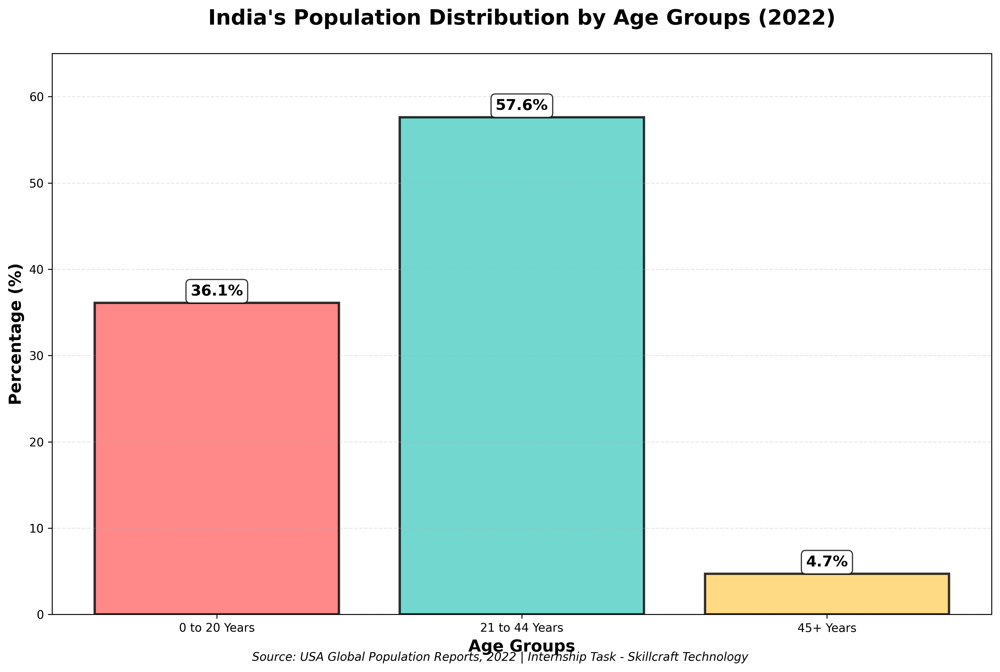

# SCT_DS_1
# Skillcraft Technology - Data Science Internship

## 👨‍💻 Intern: [Your Name]
## 🏢 Company: Skillcraft Technology
## 📅 Internship Duration: [Start Date] - [End Date]

---

## 📊 Week 1 Task: Population Distribution Visualization

### 🎯 Task Objective
Create a bar chart visualizing India's population distribution by age groups based on 2022 data.

### 📈 Project Description
This project analyzes demographic data from USA Global Population Reports 2022 to visualize how India's population is distributed across different age groups.

### 🔢 Dataset Information
- **Source**: USA Global Population Reports, 2022
- **Total Population**: 1.42 billion
- **Median Age**: 28 years

### 📋 Age Group Distribution
| Age Group | Percentage | Population |
|-----------|------------|------------|
| 0-20 Years | 36.1% | 51.3 million |
| 21-44 Years | 57.6% | 80.7 million |
| 45+ Years | 4.7% | 98 million |

### 🖼 Visualization


### 💡 Key Findings
- **Young Dominance**: 57.6% of population is between 21-44 years
- **Youth Population**: 36.1% are below 20 years
- **Aging Population**: Only 4.7% are above 45 years
- **Demographic Dividend**: India has a young population structure

### 🛠 Technologies Used
- Python 3
- Matplotlib
- Google Colab
- GitHub

### 📁 Project Files
- `week1_population_analysis.py` - Main Python analysis script
- `india_population_chart.png` - Generated visualization
- `README.md` - Project documentation

### 🚀 How to Run
```bash
python week1_population_analysis.py
